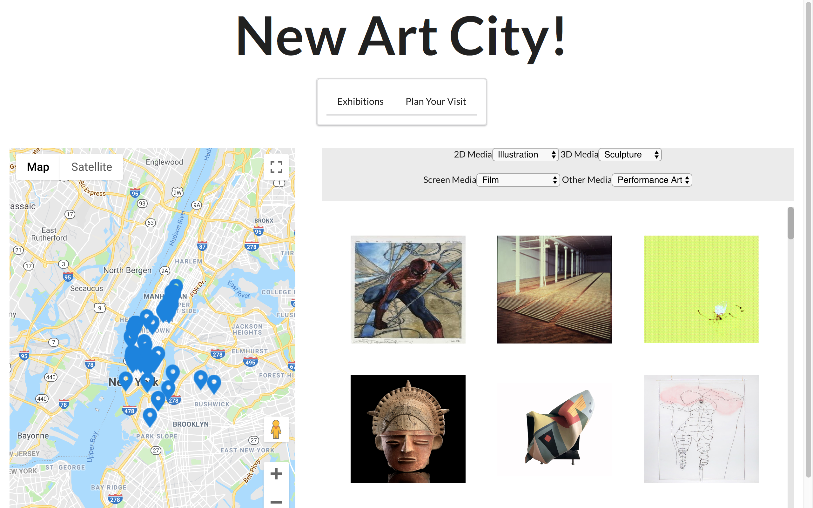

# New Art City!

*New Art City!*, an information gathering application for art lovers/casual enthusiasts to browse and bookmark current art exhibitions in NYC.

## Video Demo
https://drive.google.com/file/d/1LNDjMwa7zMj-zvyjvWM3HTqTp4oGObOI/view

## Application Features
- User can filter art exhibits by multiple media categories.

- User can view art exhibits by location on Google Maps.

- User can bookmark art exhibits to their profile.

- User can plan their visit to their bookmarked exhibits using the calendar, which takes in a range of dates and filters exhibits happening during the date range.

## Built With
- React
- Google Maps `react-google-maps`
- Calendar `react-day-picker`
- Ruby
- Rails API utilizing Active Model Serializers
- Sqlite3 Database using ActiveRecord

## Back-End Repository
https://github.com/scarlettperry/backend-new-art-city

## Server-Side Install Instructions
1. Run `bundle install`
2. Run `rake db:create`
3. Run `rake db:migrate`
4. Run `rake db:seed`
5. Run `rails s -p 3000`

## Client-Side Install Instructions
1. Run `npm install`
2. Run `npm start`

## Contributing
[Contributing Guide](./CONTRIBUTING.md)

## Author
**Scarlett Perry**

## License
[License](./LICENSE.md)

## Acknowledgments
Big thank you to Prince Wilson, Tony Lam & Eric Kim
